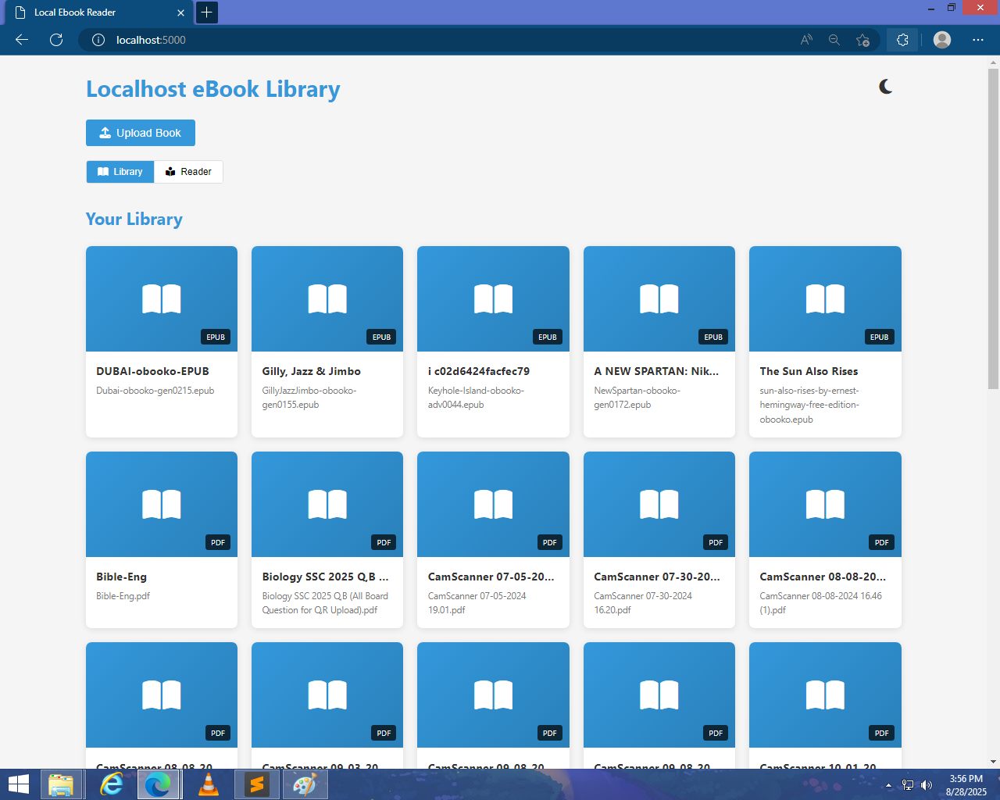
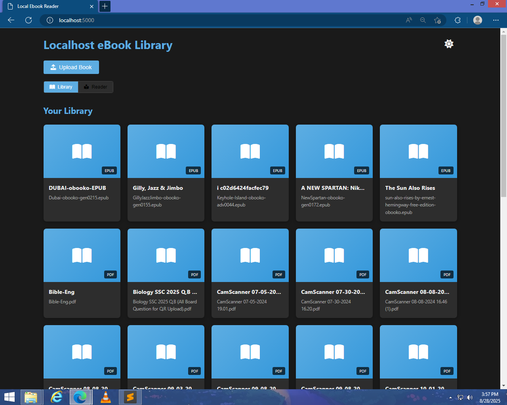

"
# 📚 LightLibrary  

**LightLibrary** is a lightweight **Flask-based ebook library** that allows users to **upload, browse, and read EPUB and PDF books** through a simple web interface.  

Designed for:  
- 💻 **Low-end PCs or older hardware**  
- 📖 Users who want a **simple local ebook library**  
- ⚡ Quick management of ebooks without heavy software  

## 🚀 Features  
- 📤 Upload EPUB and PDF files  
- 📚 Browse your ebook library  
- 📖 Read EPUB chapters directly in the browser  
- 🔍 Metadata extraction from EPUB and PDF filenames  
- Supports both **uploads** and a **books folder**  

## 🛠️ Tech Stack  
- **Backend:** Python (Flask)  
- **Frontend:** HTML, CSS, JavaScript  
- **Libraries:** `ebooklib` for EPUBs, `PyPDF2` for PDFs, `BeautifulSoup` for HTML parsing  

## 📂 Project Structure  
```
LightLibrary/
│── app.py                # Flask app
│── templates/            # HTML templates
│── static/               # CSS, JS, icons
│── uploads/              # Uploaded ebooks
│── books/                # Preloaded ebooks
│── README.md
```

## ⚙️ Installation  

1. Clone this repository:  
```bash
git clone https://github.com/yourusername/LightLibrary.git
cd LightLibrary
```

2. Install dependencies:  
```bash
pip install flask ebooklib PyPDF2 beautifulsoup4
```

3. Run the app:  
```bash
python app.py
```

4. Open in your browser:  
```
http://127.0.0.1:5000
```

5. To access from other devices on your network, use your PC’s IP:  
```
http://YOUR_PC_IP:5000
```

---

## 📷 Screenshots 

### Home Page


### Video Player



## 🎮 Usage  

1. Upload an EPUB or PDF via the upload form  
2. Browse your library to see all books in `uploads/` and `books/`  
3. Click on a book to **read chapters** (EPUB) or view PDF  

---

## 🤝 Contributing  
Pull requests are welcome! For major changes, please open an issue first to discuss what you’d like to change.  


